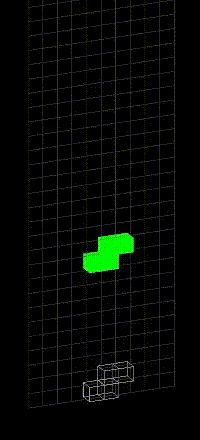

# Tetriys

A small hobby project creating a version of Tetris using my own C++ [DigitalFramework](https://github.com/TDCRanila/DigitalFramework).

My goal is to create a simple game using this framework, to help find out any API or technical problems that may occur during development.

## Compile

VisualStudio/MSVC for Windows, and GCC-14 for GNU/Linux are known to be supported compilers.

- Visual Studio build scripts are available under 'Tools'.

## Showcase

